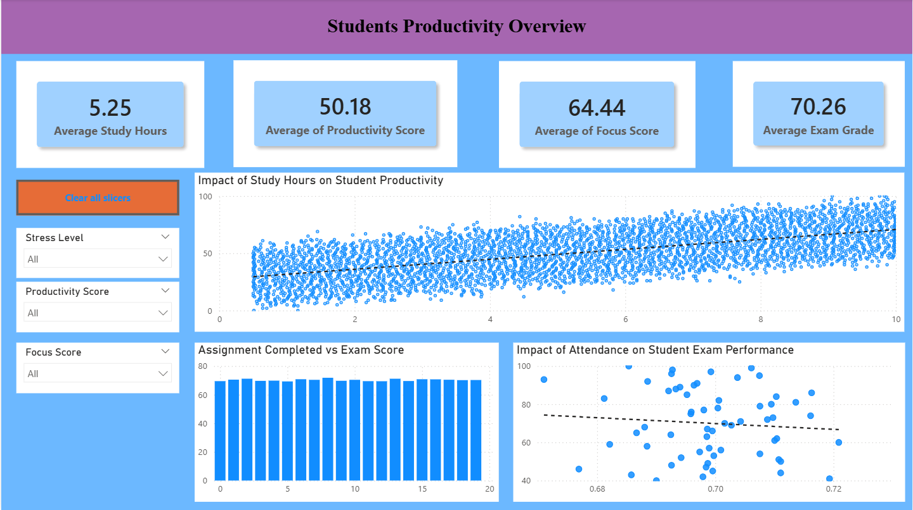
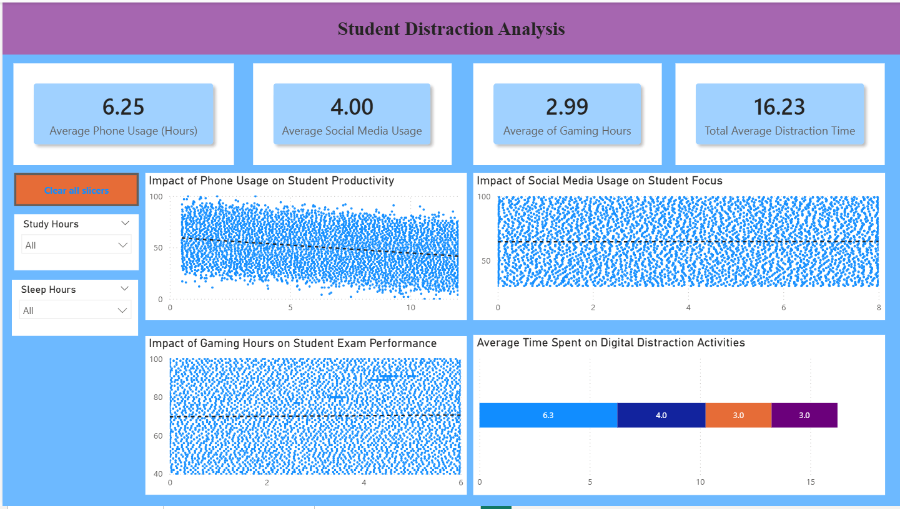
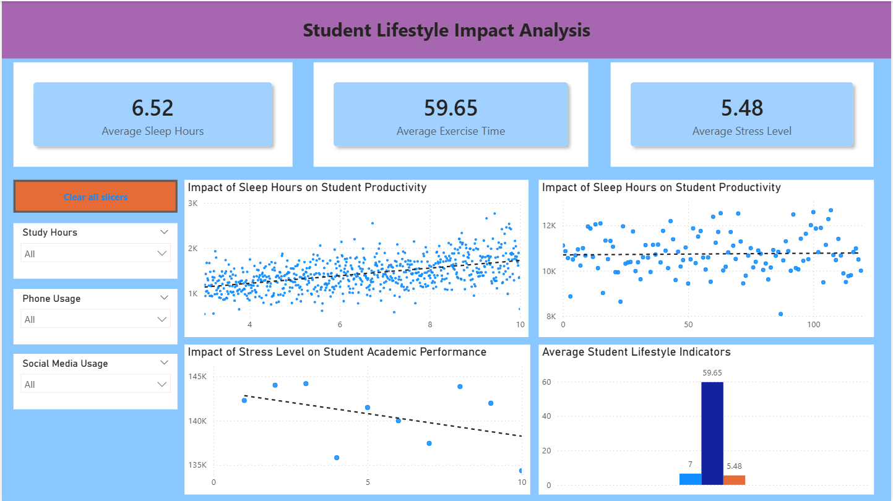

# 📊 Student Productivity & Distraction Analysis (Power BI)

## 📌 Project Overview
This project analyzes how student productivity, digital distractions, and lifestyle factors impact academic performance using Power BI dashboards.

---

## 🎯 Objectives
- Analyze relationship between study habits and exam performance
- Understand impact of digital distractions (phone, social media, gaming)
- Evaluate influence of lifestyle factors like sleep, exercise, and stress

---

## 📂 Dataset
- 20,000 student records
- Features include:
  - Study hours
  - Phone usage
  - Social media usage
  - Gaming hours
  - Sleep hours
  - Stress level
  - Final grade

---

## 📊 Dashboards

### 1️⃣ Student Productivity Overview

### 2️⃣ Student Distraction Analysis

### 3️⃣ Student Lifestyle Impact Analysis

---

## 🔍 Key Insights
- 📈 Higher study hours improve productivity and exam performance  
- 📉 Increased phone usage reduces productivity  
- 😴 Better sleep improves focus and productivity  
- 😓 Higher stress negatively impacts academic performance  

---

## 🛠 Tools Used
- Power BI
- Data Visualization
- DAX (Data Analysis Expressions)

---

## 🙏 Acknowledgment
Special thanks to my mentor for their guidance and support throughout this project.

---

## 🚀 Future Scope
- Integrate real-time student data
- Apply machine learning models for prediction
- Expand analysis with additional behavioral factors